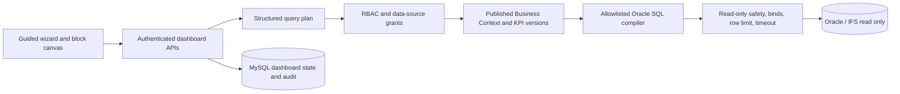
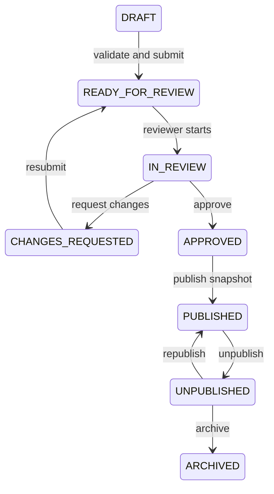

# Phase 4 — Guided Dashboard Builder

## Scope

Phase 4 adds a governed, block-based dashboard workflow on top of Phase 3. Builders never choose raw Oracle tables or write SQL. They select one immutable published Business Context version, approved or certified KPI versions, and published Business Fields.

## Architecture



The structured query plan is the source of truth. Generated SQL is derived, fingerprinted, validated, and stored for explainability. Filters are bind parameters and identifiers come only from synchronized, approved metadata.

## Workflow and roles

The existing role model is retained:

| Existing role | Phase 4 responsibility |
| --- | --- |
| `VIEWER` | View authorized published dashboards |
| `DASHBOARD_CREATOR` | Create and edit owned drafts, preview, validate, request AI, submit |
| `DATA_SOURCE_CREATOR` | Business Context technical inspection; no dashboard publication |
| `ADMIN` | Reviewer, publisher, access governance, and system administration |



Published versions are immutable. Further editing clones the exact context, KPI, blocks, filters, and layout into a new draft version.

## Builder workflow

1. Define purpose, objective, audience, questions, category, refresh expectation, and date range.
2. Select an accessible published Business Context snapshot.
3. Select one of five responsive layout templates.
4. Add governed blocks and select locked KPI versions and compatible dimensions.
5. Add global filters from approved filterable fields.
6. Run safe previews with a 100-row maximum.
7. Run configuration, context, KPI, query, access, and quality validation.
8. Review explainability, AI decisions, and submit for approval/publication.

Draft metadata uses an 800 ms debounced autosave. Every update includes the loaded revision. A stale revision returns HTTP 409 with `STALE_VERSION`.

## AI recommendation architecture

The dashboard AI provider is configured only on the server:

```env
AI_PROVIDER=openai-compatible
AI_BASE_URL=https://generativelanguage.googleapis.com/v1beta/openai
AI_MODEL=gemini-2.5-flash
AI_API_KEY=replace-with-secret
```

`AI_API_KEY` is read from `.env` at request time and is never included in client state, MySQL records, prompts, responses, or logs. The current configuration uses Gemini through its OpenAI-compatible chat-completions endpoint.

AI receives only:

- Dashboard purpose and questions
- Approved AI-allowed Business Objects and Fields
- Valid approved relationships
- Approved or certified KPIs
- Existing block configuration

Credentials, physical table/column names, hidden/sensitive fields, and Oracle row data are excluded. Output is parsed with a strict Zod schema and rechecked with deterministic compatibility rules. Recommendations remain `PENDING`; only explicit Accept applies a recommendation, while Accept and Reject are audited.

## SQL safety and preview

- `SELECT`/`WITH ... SELECT` only
- DDL, DML, PL/SQL, transaction statements, multiple statements, and comments are rejected
- Oracle identifiers are allowlisted and quoted from approved Business Context mappings
- Filters use bind variables
- Preview is capped at 100 rows and 1 MB
- Concurrency is capped at three preview queries per process
- Oracle connection timeout and call timeout come from the Data Source configuration
- Query text and bind names are stored; bind values and credentials are not logged
- Normal dashboard users cannot retrieve generated SQL or technical bind details
- Failed live previews are labelled `QUERY_VALIDATION_FAILED`; sample charts are labelled as non-business-data configuration previews

## Database and migration

Migration `0007_phase4_dashboards.sql` adds:

- `dashboard_layout_templates`
- `dashboards`
- `dashboard_versions`
- `dashboard_blocks`
- `dashboard_global_filters`
- `dashboard_validation_findings`
- `dashboard_ai_recommendations`
- `dashboard_reviews`
- `dashboard_publications`

Apply all idempotent migrations to MySQL:

```bash
npm run db:migrate
npm run db:seed
```

The seed is idempotent. When a published Business Context exists, it creates one draft, one in-review, and one published dashboard example linked to that exact context snapshot. No migration or seed writes to Oracle; Oracle use is limited to read-only preview queries.

## Testing

```bash
npm run lint
npm run typecheck
npm test
npm run build
```

Phase 4 tests cover role mapping, lifecycle transitions, unsafe SQL rejection, visualization compatibility, validated dashboard/block/query-plan inputs, row limits, and strict human-confirmed AI output.

## Known limitations and Phase 5 handoff

- Initial query plans support KPI source objects and dimensions already reachable through the KPI's approved relationship graph. Ambiguous or missing paths are rejected.
- Runtime filter widgets are configured and snapshot-ready; richer cascading-value lookup is deferred.
- The canvas is a responsive CSS grid without drag-and-drop or multi-level undo history.
- Preview charts use lightweight native rendering. A charting library can be added when interaction requirements stabilize.
- Dashboard access uses owner plus private/role/workspace visibility. Per-user and organization grants are a Phase 5 extension.
- Phase 5 should add scheduled refresh/cache orchestration, richer runtime interactions, export jobs, cross-dashboard drill-through, and a governed runtime Copilot.
